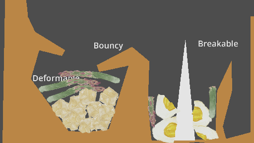
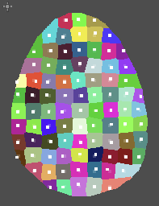
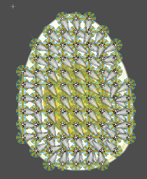

#  SoftBody2D

# Introduction

Create a 2D Soft Body from a Texture.

# How to install

Download the sourcecode and move only the addons folder it contains into your project folder addons folder. 

# Features

The softbody is constructed out of multiple pieces. The texture is first split into multiple polygons from a source image, the rigidbodies are created and connected with joints.

## Polygon

* Vertex Interval: This sets how far apart two rigidbodies will be.
* Voronoi Interval: This sets how much will the rigidbodies move relative to their original center.
* Polygon Offset: Do manual adjustments if bodies are not generated how you want them.
* Min Area: If the resulting area of a body is too small, merge it with a nearby area.

## Image

* Margin Pixels: Shrink or Expand the original image
* Texture Epsilon: Get more or less points on the polygon outline
* Min Alpha: Minimum alpha needed to consider texture part of softbody.
* Exclude Texture: Texture to be used in order to exclude area. This is used to make soft bodies with holes.

## Joint

* Max Joint Distance Ratio: Max distance ratio to connect rigidbodies with joints, relative to vertex_interval distance.
* Joint Type: This plugin supports Pin or Spring joint
* Bias, Disable Collision, Stiffness, Damping, Softness: Joint specific properties

## Rigidbody

* Script: Add a custom script to be added to the rigidbody.
* Radius, collision layer, collision mask, mass, pickable, lock rotation, material override: Rigidbody specific properties.

# How it works

## 1. Creating the Polygon

1. Creates edge vertices from texture.

2. Creates multiple voronoi regions with roughly same total size as the edge vertices AABB.

3. Delete the voronoi regions not inside the polygon.

4. Assigns these polygons to the `Polygon2D.polygon` and `Polygon2D.polygons`.

## 2. Creating the Skeleton2D

1. Creates a `Skeleton2D` child.
2. Creates a set of `Bone2D`` nodes of the `Skeleton2D`, each having a voronoi region and assign correct weights to them.

## 3. Creating the RigidBody2D nodes and the joints

1. Creates a set of `RigidBody2D` nodes, one for each voronoi region.
2. Creates for each `Bone2D` a `Rigidody2D` with a `CollisionShape2D` (with a `CircleShape2D` shape) child, a `RemoteTransform2D` child that targets the `Bone2D` position, and either `DampedSprintJoint2D` or `PinJoint2D` children that connects each other neighbour nodes.

## 4. For breakable softbodies

1. When the joint length is too big, the joints breaks. Then, the weights for both bones are updated to no longer have weights in other voronoi region.

That's it. Because of the way the bones weights are built, they have overlapping points that just need to be removed when joint is broken. Easy!

# Credits

Uses parts of code from (godot-chunked-voronoi-generator)[https://github.com/arcanewright/godot-chunked-voronoi-generator]
