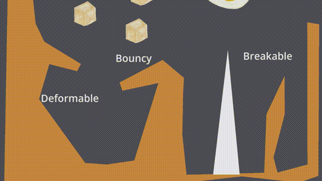
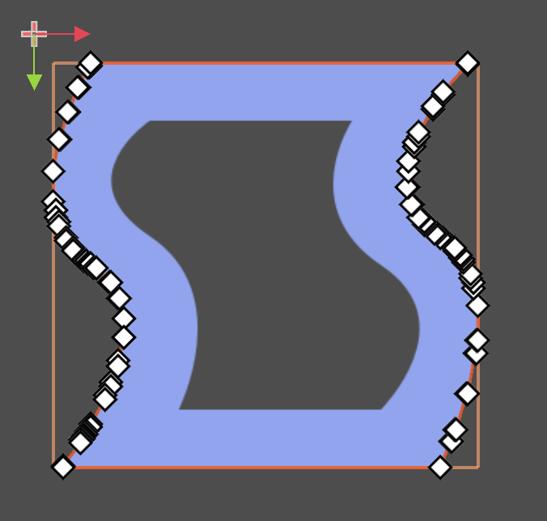
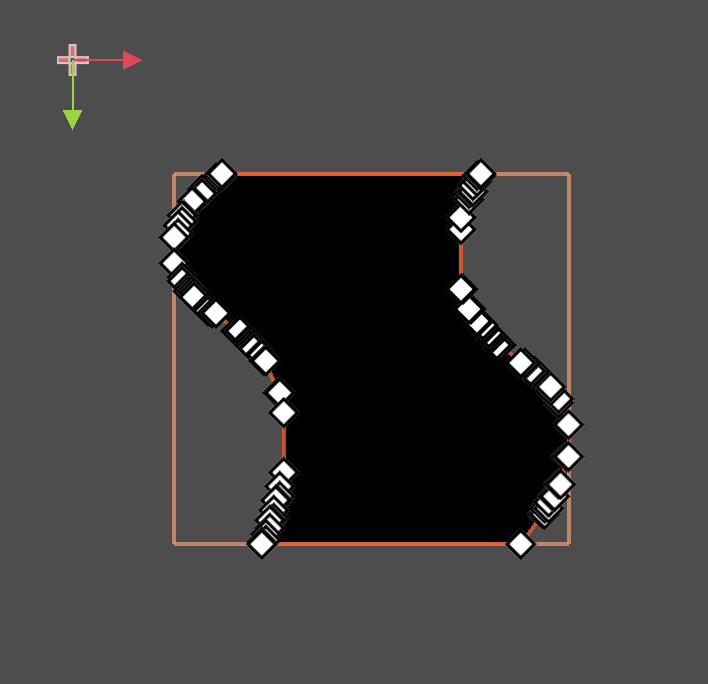
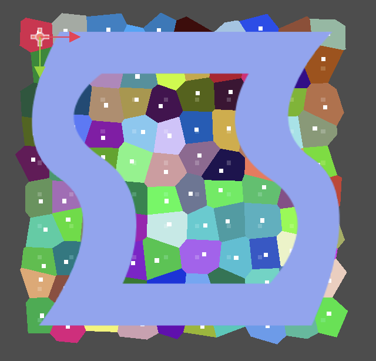
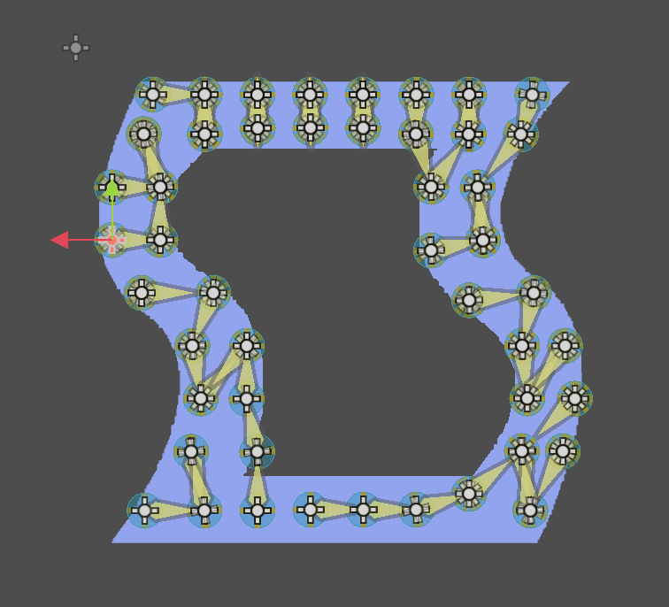

	 
	<h1 align="center">Godot SoftBody2D </h1> 

A SoftBody2D is defined by a set of RigidBody2Ds used to simulate it and a Skeleton2D used to deform the polygon.

# Installation

- Automatic (Recommended): Download the plugin from the official [Godot Asset Store](https://godotengine.org/asset-library/asset/1621) using the `AssetLib` tab in Godot.
- Manual: Download the source code and move only the addons folder into your project addons folder.

# Features

You can create multiple types of softbodies with this plugin, such as:

- Bouncy softbody
- Breakable/Deformable softbody
- Softbody with hole
- Circle shaped softbody
- Line shaped softbody
- Really any shape softbody

# Video Tutorial

# How this plugin creates a softbody

<table>

<tr>
<td>
1. Create polygon from texture around edge.
</td>
<td>
 
</td>
</tr>

<tr>
<td>
2. Optionally do the same for hole texture.
</td>
<td>
 
</td>
</tr>

<tr>
<td>
3. Create multiple regions of same size around polygon.
</td>
<td>
 
</td>
</tr>

<tr>
<td>
4. Delete the regions the polygon or inside the hole polygon.
</td>
<td>
 
</td>
</tr>

<tr>
<td>
5. Creates a `Skeleton2D` child. Creates a set of `Bone2D` nodes of the `Skeleton2D`, each having a region and assign correct weights to them.
</td>
<td>
 
</td>
</tr>

<tr>
<td>
6. Creates a set of `RigidBody2D` nodes, one for each region with a `CollisionShape2D` child, a `RemoteTransform2D` child that targets the coresponding `Bone2D` position, and a set of `Joint2D` children that connect neighbouring rigidbodies. Also for each `Bone2D` node, make it lookat another neighbour node.
</td>
<td>
 
</td>
</tr>
<tr>

<td>
7. When the joint length is too big, the joints breaks. Then, the weights for both bones are updated to no longer have weights in the other region.
</td>
<td width=256>
</td>
</tr>
</table>

# [Discord](https://discord.gg/56dMud8HYn)

A vibrant community for discussion, user support and showcases.

# License

Godot SoftBody2D is distributed under the MIT license. See `LICENSE` for more details.

Uses parts of code from (godot-chunked-voronoi-generator)[https://github.com/arcanewright/godot-chunked-voronoi-generator]
