#  softbody2d

## Introduction

Create squishy Softbody2D that can simulate bouncy or deformable or breakable bodies.

If you want Breakable Softbody2D add RigidbodyScript field to `breakable_rigidbody2d.gd`(done in inspector at SoftBody2D/Rigidbody/Rigidbody Script)
, which you can also extend.

Add Softbody2D script to Polygon2D with texture. Click bake.

## How non breakable softbodies work

1. Creates a huge voronoi diagram:

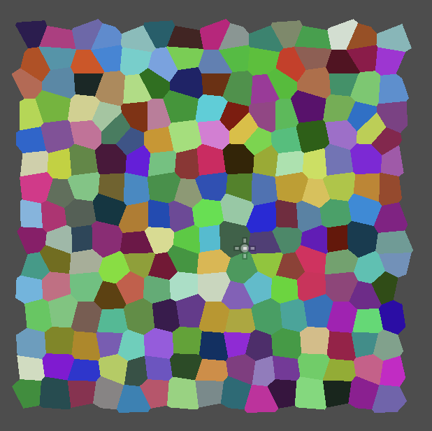

This way we have a fairly random distribution of points and we know where each region is separated

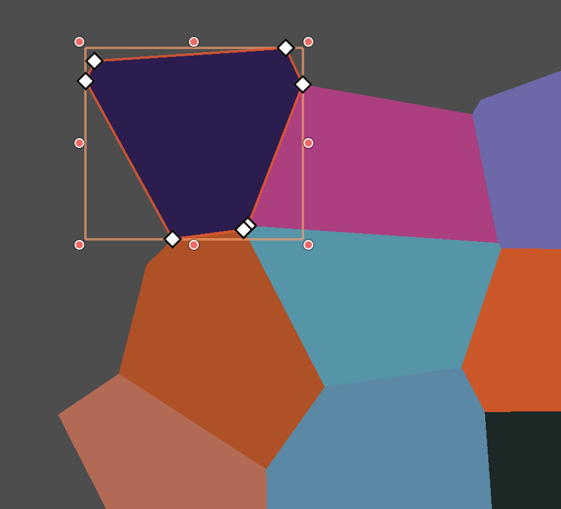

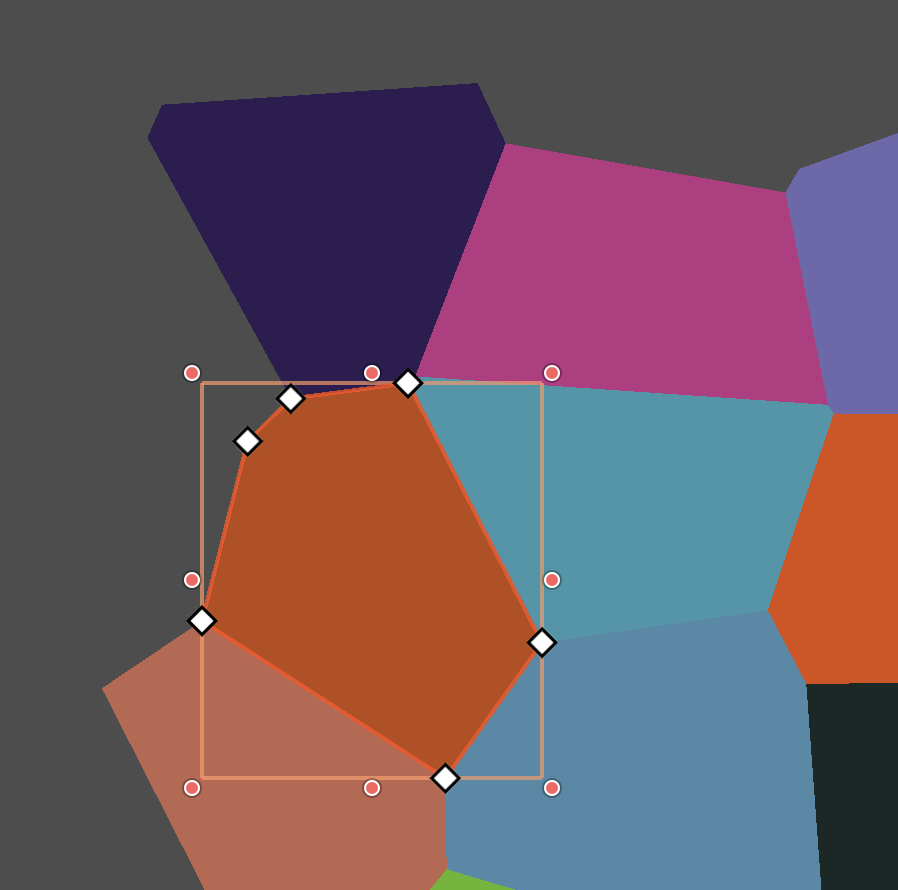

2. Assigns it to the `Polygon2D` node as polygons that are inside initial texture:

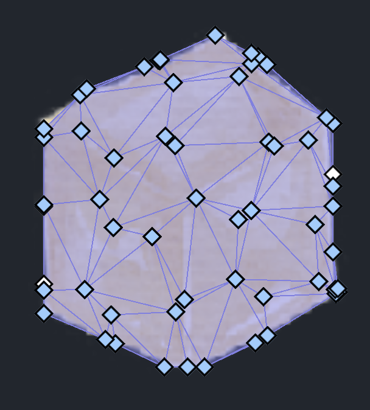

3. Create a skeleton with `Bone2D` nodes for each voronoi region that is inside the polygon.

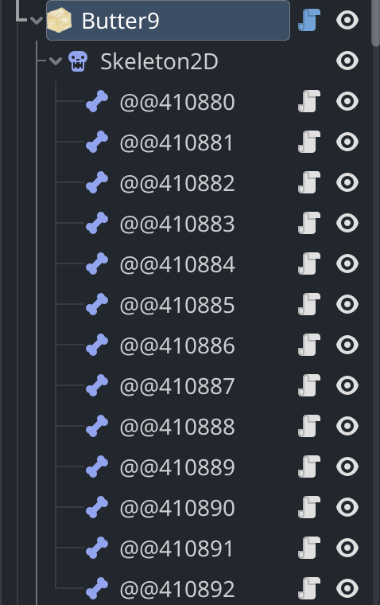

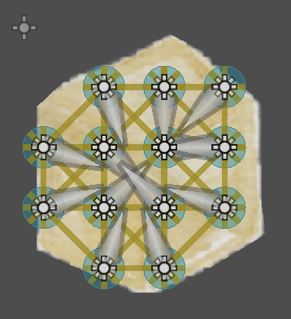

4. Assign to the `Bone2D` weights with all points of that region, and also all overlapping points from neighbouring regions. Also notes on each bone what points it contained initially from voronoi region.

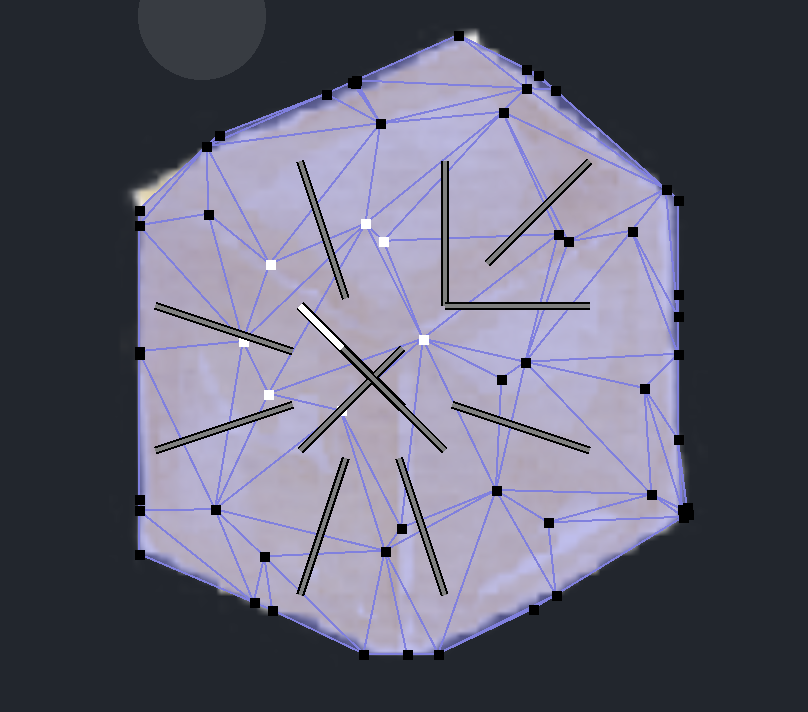

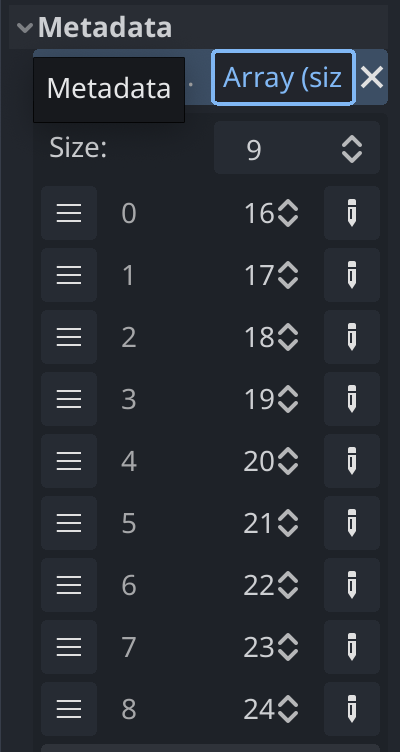

5. Set direction of each `Bone2D` to follow the middle of each neighbouring bones. This is done by `look_at_center_2d.gd` script. This one follows all neighbour bones. These are assigned when baking.

6. Creates for each bone a `Rigidbody2D` with a `CollisionShape2D`(with `Circle` of radius specified in inspector) child, a `RemoteTransform2D` child that targets thte `Bone2D` position, and either `DampedSprintJoint2D` or `PinJoint2D` children that connects each other neighbour nodes(the joint type is configurable from inspector).

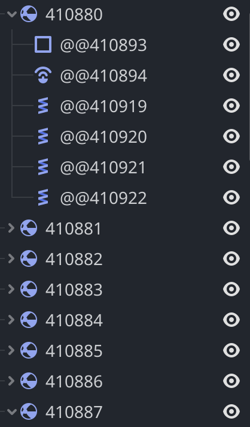

## For breakable softbodies

If you assign to each rigidbody a `breakable_rigidbody2d.gd` script(done in inspector at SoftBody2D/Rigidbody/Rigidbody Script)

1. When the joint length is too big, the joints breaks. Then, the script `breakable_rigidbody2d.gd` calls on SoftBody2D script `remove_joint` function, which changes weights for both bones to no longer have weights in other voronoi region.

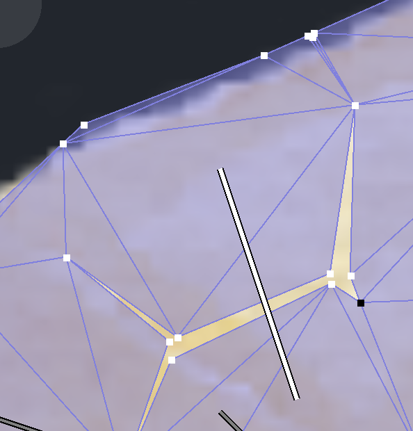
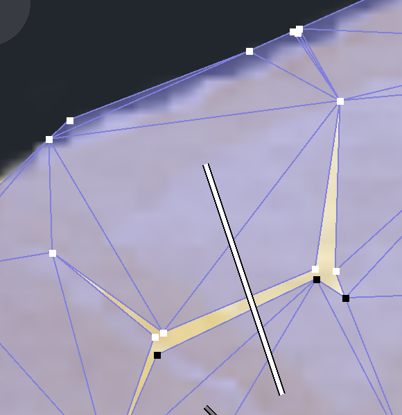

That's it. Because of the way the bones weights are built, they have overalapping points that just need to be removed when joint is broken. Easy!

## Changelog

### Version 0.8

- Fix issue that occured when breaking softbody and bone wouldn't look in correct direction. Also improved how bones look for direction in general.

### Version 0.7

- Use also PinJoin2D for joints to obtain more bouncy softbodies. Also let option to generate with old SpringJoint.

### Version 0.6

- Change how softbodies are generated. Use voronoi for generating polygons, then store polygons for each bone. This is used for cutting softbodies.
- There is now option to cut softbodies, making them breakable. This is done by adding breakable_rigidboy2d.gd script(you can also extend it). Still wip.

### Version 0.5

- Create just one script, SoftBody2D that you can put on a Polygon2D that generates all nodes below.

### Version 0.4

- Fix bug where if object is rotated weight generation isn't correct.

### Version 0.3

- Add more tips on how to get a good simulation
- Fix case where if root object is rotated, generation doesn't work.

### Version 0.2

- Fix bug with version 4.0 RC3.
- Add more options, make defaults more stable.
- Add more docs on how to use.

### Version 0.1

- Initial Release
